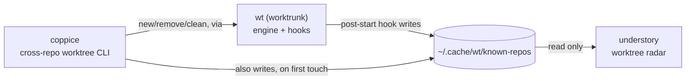

# canopy

An interactive dashboard for every agent CLI session (`pi`, `claude`,
`codex`, ...) running on this machine, wherever it actually is: a VS Code
integrated terminal or a bare Ghostty tab, with its live state and
jump-to-window on Enter.

This is the Go implementation, and the one actively developed going
forward. An earlier Python/Textual prototype lives at `../canopy-python`
(kept for reference, no longer installed); this version has the same
behavior, ported to a single static binary: no interpreter, no venv,
instant startup.

canopy's only job is agent sessions; it has no notion of git worktrees at
all. If you also use git worktrees, see [Ecosystem](#ecosystem) below for
the sibling tools that cover that.

## Ecosystem

canopy is one of four tools that split "what's running, and where, on
this machine" into two independent radars over two independent lifecycle
tools, one pair for agent sessions, one pair for git worktrees:

| Tool | Layer | Job |
|---|---|---|
| [`wt`](https://worktrunk.dev) (worktrunk) | engine | creates/removes worktrees, runs lifecycle hooks (`post-start`, `pre-remove`, ...), maintains the shared registry |
| [coppice](https://github.com/luiul/coppice) | lifecycle CLI | cross-repo `new`/`list`/`remove`/`clean` worktrees, on top of `wt`, from anywhere on disk |
| [understory](https://github.com/luiul/understory) | worktree radar | live, read-only dashboard of every worktree in the registry; open-or-focus a VS Code window on Enter |
| **canopy** (this repo) | agent radar | live, read-only dashboard of every agent CLI session on the machine; jump-to-window on Enter |



canopy doesn't appear in that diagram on purpose: it's fully independent
of `wt`'s registry, and of the other three tools. It discovers agent
processes directly via `ps`/`lsof` and AppleScript for Ghostty, the same
way understory discovers worktrees, just from a completely different
source. The two dashboards (canopy, understory) are designed to run side by
side, each a `tab`-free, single-view radar over one kind of thing, rather
than one tool trying to be both. This split happened deliberately: canopy
briefly grew a second "Worktrees" view (agent-to-worktree matching,
jump-to-worktree) before that code was pulled out into understory, so
canopy's scope could stay exactly "agent sessions," nothing else.

## What it looks like

```
canopy — agent sessions on this machine
3 sessions: 1 blocked · 1 working · 1 idle

   State      Since   Surface    Location                                  Kind     PID
>  working    12s     VS Code    ~/projects/personal/canopy                pi       86872
   blocked    3m      VS Code    ~/worktrees/.../isa-orchestration         pi       9514
   idle       1h20m   Ghostty    ~/some/other/project                     pi       65834

↑/↓ move · enter jump · c complete · r refresh · q quit
```

The currently selected row is marked with a `>` in the leftmost column
(rather than a full-row highlight, which would hide State's color coding
on whichever row happens to be selected). Columns are ordered by urgency,
left to right: State and Since (what needs you, and for how long) come
first, then Surface and Location (where the session lives). Kind and PID
are last and deliberately narrow, truncating before anything else does on
a tight terminal: useful context, but rarely what you're scanning for.
Location shortens a leading home-directory prefix to `~`, same as your
shell prompt.

State is color-coded (red (bold) for `blocked`, green (bold) for `done`,
yellow for `working`, dim for `idle`/`unknown`), and a row that just
transitioned into `blocked` or `done` flashes briefly (a trailing `*`
plus a reverse-video highlight) so it's hard to miss. `blocked` and
`done` are also the two states that ring the terminal bell (ASCII BEL)
the moment a row newly transitions into either — the one signal here that
reaches you even if canopy's own pane isn't the one on screen (a dock
bounce, tab badge, or audible beep, depending on your terminal's own bell
setting), unlike the color/flash treatment, which only helps once you're
already looking at it. It only fires on the transition itself, not on
every poll a row happens to stay blocked/done — including the first poll
right after canopy starts up, if a session is already sitting blocked or
done at that point (same as the flash treatment, which also treats "just
discovered" the same as "just transitioned"). Sessions are sorted
most-actionable first: `blocked`, then `done`, then `working`, then
`idle`/`unknown`. Pass `--no-color` (or set `NO_COLOR`) to disable the
color/flash treatment and get plain text, and `--no-bell` to disable just
the bell.

A row that's `done` stays `done` (still sorted to the top, still
colored, still bell-eligible for its own transition) until you actually
do something about it: press `enter` to jump to it (which also marks it
seen right away), or `c` to mark it seen in place without jumping at
all. Either one immediately displays that row as `idle` and drops it
back down in the sort order, no poll wait required. It goes back to
reading `done` — unacknowledged — the next time it actually earns that
state again (a fresh turn ending), not on every subsequent poll where
the underlying session happens to still be sitting done.

## Why Go, not Python

canopy is 100% process discovery, subprocess orchestration, and a polling
TUI, no real computation. That profile made a compiled language a better
fit: no interpreter/venv to install or drift across Python versions,
near-instant startup for a tool you re-launch constantly, and `os/exec`
maps almost line-for-line onto every subprocess call the original Python
prototype made. Measured against that prototype: ~34x faster startup,
~3.4x less idle RSS, ~23x smaller install footprint (single 3.4 MB binary
vs. an interpreter + venv).

## Architecture

See [docs/agent-state-machine.md](docs/agent-state-machine.md) for the
finite state machine behind a row's state, including the invariant
that a `done` row only ever leaves `done` via `enter` or `c`.

One Go package per concern:

- `internal/scan`: shells out to `ps`/`lsof`, parses their output into
  typed rows.
- `internal/state`: CPU%-based idle/working heuristic for processes not
  running in VS Code or Ghostty.
- `internal/pistatus`: reads the small status file the optional
  `extensions/canopy-status.ts` companion writes for a running `pi`
  process, so canopy can use pi's own real working/idle/done instead of
  the CPU heuristic for that one agent kind (see "Real pi status" below).
- `internal/ancestry`: walks a process's parent chain to classify which app
  (VS Code / Ghostty) is hosting it.
- `internal/applescript`: `osascript` wrapper for focusing a Ghostty window
  by working directory and a VS Code window by title, with macOS
  Automation-permission error detection.
- `internal/jump`: picks the actual jump mechanism (`code --reuse-window` or
  Ghostty AppleScript) per row, switching to an already-open window when one
  matches the row's working directory, or opening a brand-new one when none
  does.
- `internal/registry`: merges a fresh poll against the previous one so a
  single missed `ps`/poll doesn't flicker a row away.
- `internal/tui`: the Bubble Tea dashboard (table, polling timer,
  jump-on-Enter, notifications).
- `cmd/canopy`: the CLI entry point (flags, version).

## Install

```bash
cd canopy
go build -o /tmp/canopy-build ./cmd/canopy
install -m 0755 /tmp/canopy-build ~/.local/bin/canopy   # or anywhere on PATH
```

Or, if `$(go env GOPATH)/bin` (usually `~/go/bin`) is on your `PATH`:

```bash
go install ./cmd/canopy
```

## Development

```bash
go build ./...
go vet ./...
go test ./...
gofmt -l .   # should print nothing
```

## Real pi status (optional)

Canopy has no pty for a `pi` process running outside a terminal it owns, so by default it falls
back to the same CPU% heuristic every other agent kind gets. `pi` is the
one agent kind canopy can ask directly instead of guessing, though:
`extensions/canopy-status.ts` is a small companion pi extension (see
docs/extensions.md in the pi repo) that hooks pi's own agent-lifecycle
events (`before_agent_start`, `agent_start`, `tool_execution_start`,
`agent_settled`) and writes a tiny `~/.pi/agent/canopy-status/<pid>.json`
file with pi's real state, which `internal/pistatus` reads straight into
that pid's `RegistryEntry`, no CPU sampling involved.

Install it by symlinking (or copying) it into pi's global extensions
directory:

```bash
ln -s "$(pwd)/extensions/canopy-status.ts" ~/.pi/agent/extensions/canopy-status.ts
```

It reports `working` while pi is actively running, and `done`
unconditionally once a turn ends — no frontmost/focus detection at all
(see docs/agent-state-machine.md's "Removed: frontmost/focus detection"):
canopy's dashboard already requires an explicit `enter` or `c` on the row
before it displays anything other than `done`, so guessing whether you
were already looking at that terminal at settle-time couldn't change what
you'd see there either way. One consequence: the bell/flash now fires on
every settled turn, including ones you watched finish directly in the
terminal, not just ones you missed. It does not report `blocked`: vanilla
pi has no built-in permission-gate pause to detect that from. macOS only;
not installing it (or running on another OS) just leaves canopy on the CPU
heuristic, same as today.

## Limitations

- Same machine, same user only.
- Idle/working for non-`pi` surfaces (and `pi` itself without the extension
  above installed) is a CPU% heuristic, not a real status.
- Ghostty jump-to matches by working directory, not tty/pid; ambiguous if
  two tabs share a cwd. If no open tab matches anymore (e.g. it was closed),
  Enter opens a brand-new Ghostty window at that cwd instead, same
  reuse-or-create behavior as VS Code's own title-based window match.
- VS Code jump-to matches by window title (folder basename), the same weak
  key as Ghostty's cwd match: two open windows on differently-located repos
  that happen to share a leaf folder name are indistinguishable by title
  alone. Raises the right window but not necessarily the specific
  integrated-terminal tab within it.
- Mouse click-to-jump/acknowledge isn't implemented (keyboard only: arrow
  keys, Enter, c); Bubble Tea's table widget doesn't ship row-click
  handling out of the box the way Textual's `DataTable` does.
