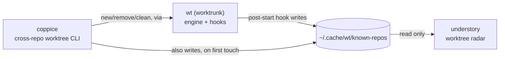

# canopy

An interactive dashboard for every agent CLI session (`pi`, `claude`,
`codex`, ...) running on this machine, wherever it actually is: a VS Code
integrated terminal or a bare Ghostty tab, with its live state and
jump-to-window on Enter.

This is the Go implementation, and the one actively developed going
forward. An earlier Python/Textual prototype lives at `../canopy-python`
(kept for reference, no longer installed); this version has the same
behavior, ported to a single static binary: no interpreter, no venv,
instant startup.

canopy's only job is agent sessions; it has no notion of git worktrees at
all. If you also use git worktrees, see [Ecosystem](#ecosystem) below for
the sibling tools that cover that.

## Ecosystem

canopy is one of four tools that split "what's running, and where, on
this machine" into two independent radars over two independent lifecycle
tools, one pair for agent sessions, one pair for git worktrees:

| Tool | Layer | Job |
|---|---|---|
| [`wt`](https://worktrunk.dev) (worktrunk) | engine | creates/removes worktrees, runs lifecycle hooks (`post-start`, `pre-remove`, ...), maintains the shared registry |
| [coppice](https://github.com/luiul/coppice) | lifecycle CLI | cross-repo `new`/`list`/`remove`/`clean` worktrees, on top of `wt`, from anywhere on disk |
| [understory](https://github.com/luiul/understory) | worktree radar | live, read-only dashboard of every worktree in the registry; open-or-focus a VS Code window on Enter |
| **canopy** (this repo) | agent radar | live, read-only dashboard of every agent CLI session on the machine; jump-to-window on Enter |



canopy doesn't appear in that diagram on purpose: it's fully independent
of `wt`'s registry, and of the other three tools. It discovers agent
processes directly via `ps`/`lsof` and AppleScript for Ghostty, the same
way understory discovers worktrees, just from a completely different
source. The two dashboards (canopy, understory) are designed to run side by
side, each a `tab`-free, single-view radar over one kind of thing, rather
than one tool trying to be both. This split happened deliberately: canopy
briefly grew a second "Worktrees" view (agent-to-worktree matching,
jump-to-worktree) before that code was pulled out into understory, so
canopy's scope could stay exactly "agent sessions," nothing else.

## What it looks like

```
canopy — agent sessions on this machine
3 sessions: 1 blocked · 1 working · 1 idle

   Surface    State      Since   Kind        PID       Location
>  VS Code    working    12s     pi          86872     ~/projects/personal/canopy
   VS Code    blocked    3m      pi          9514      ~/worktrees/.../isa-orchestration
   Ghostty    idle       1h20m   pi          65834     ~/some/other/project

↑/↓ move · enter jump · r refresh · q quit
```

The currently selected row is marked with a `>` in the leftmost column
(rather than a full-row highlight, which would hide State's color coding
on whichever row happens to be selected). Location shortens a leading
home-directory prefix to `~`, same as your shell prompt.

State is color-coded (red for `blocked`, green for `done`, yellow for
`working`, dim for `idle`/`unknown`), and a row that just transitioned into
`blocked` or `done` flashes briefly (a trailing `*` plus a reverse-video
highlight) so it's hard to miss. Sessions are sorted most-actionable
first: `blocked`, then `done`, then `working`, then `idle`/`unknown`. Pass
`--no-color` (or set `NO_COLOR`) to disable all of that and get plain text.

## Why Go, not Python

canopy is 100% process discovery, subprocess orchestration, and a polling
TUI, no real computation. That profile made a compiled language a better
fit: no interpreter/venv to install or drift across Python versions,
near-instant startup for a tool you re-launch constantly, and `os/exec`
maps almost line-for-line onto every subprocess call the original Python
prototype made. Measured against that prototype: ~34x faster startup,
~3.4x less idle RSS, ~23x smaller install footprint (single 3.4 MB binary
vs. an interpreter + venv).

## Architecture

One Go package per concern:

- `internal/scan`: shells out to `ps`/`lsof`, parses their output into
  typed rows.
- CPU%-based idle/working heuristic for processes not running in VS Code or
  Ghostty.
- `internal/pistatus`: reads the small status file the optional
  `extensions/canopy-status.ts` companion writes for a running `pi`
  process, so canopy can use pi's own real working/idle/done instead of
  the CPU heuristic for that one agent kind (see "Real pi status" below).
- `internal/ancestry`: walks a process's parent chain to classify which app
  (VS Code / Ghostty) is hosting it.
- `internal/applescript`: `osascript` wrapper for focusing a Ghostty window
  by working directory, with macOS Automation-permission error detection.
- `internal/jump`: picks the actual jump mechanism (`code --reuse-window` or
  Ghostty AppleScript) per row.
- `internal/registry`: merges a fresh poll against the previous one so a
  single missed `ps`/poll doesn't flicker a row away.
- `internal/tui`: the Bubble Tea dashboard (table, polling timer,
  jump-on-Enter, notifications).
- `cmd/canopy`: the CLI entry point (flags, version).

## Install

```bash
cd canopy
Go build -o /tmp/canopy-build ./cmd/canopy
install -m 0755 /tmp/canopy-build ~/.local/bin/canopy   # or anywhere on PATH
```

Or, if `$(go env GOPATH)/bin` (usually `~/go/bin`) is on your `PATH`:

```bash
go install ./cmd/canopy
```

## Development

```bash
go build ./...
go vet ./...
go test ./...
gofmt -l .   # should print nothing
```

## Real pi status (optional)

Canopy has no pty for a `pi` process running outside a terminal it owns, so by default it falls
back to the same CPU% heuristic every other agent kind gets. `pi` is the
one agent kind canopy can ask directly instead of guessing, though:
`extensions/canopy-status.ts` is a small companion pi extension (see
docs/extensions.md in the pi repo) that hooks pi's own agent-lifecycle
events (`before_agent_start`, `agent_start`, `tool_execution_start`,
`agent_settled`) and writes a tiny `~/.pi/agent/canopy-status/<pid>.json`
file with pi's real state, which `internal/pistatus` reads straight into
that pid's `RegistryEntry`, no CPU sampling involved.

Install it by symlinking (or copying) it into pi's global extensions
directory:

```bash
ln -s "$(pwd)/extensions/canopy-status.ts" ~/.pi/agent/extensions/canopy-status.ts
```

It reports `working` while pi is actively running, and `idle` or `done`
once a turn ends, depending on whether you were already looking at that
terminal (same frontmost-app check used by desktop-notification setups) —
`done` then flips to `idle` on its own, the moment you bring that terminal
to the front, without waiting for you to send another prompt. It does not
report `blocked`: vanilla pi has no built-in permission-gate pause to
detect that from (see the comment at the top of the file for how a
permission-gate extension could feed it one). macOS only; not installing
it (or running on another OS) just leaves canopy on the CPU heuristic,
same as today.

## Limitations

- Same machine, same user only.
- Idle/working for non-`pi` surfaces (and `pi` itself without the extension
  above installed) is a CPU% heuristic, not a real status.
- Ghostty jump-to matches by working directory, not tty/pid; ambiguous if
  two tabs share a cwd.
- VS Code jump-to raises the right window but not necessarily the specific
  integrated-terminal tab within it.
- Mouse click-to-jump isn't implemented (keyboard only: arrow keys +
  Enter); Bubble Tea's table widget doesn't ship row-click handling out of
  the box the way Textual's `DataTable` does.
