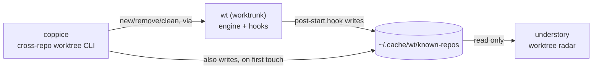

# canopy

An interactive dashboard for every agent CLI session on this machine (`pi` tracked by default; the set is yours to configure, see [Configuration](#configuration)), wherever it actually is: a VS Code integrated terminal or a bare Ghostty tab, with its live state and jump-to-window on Enter.

This is the Go implementation, and the one actively developed going
forward. An earlier Python/Textual prototype lives at `../canopy-python`
(kept for reference, no longer installed); this version has the same
behavior, ported to a single static binary: no interpreter, no venv,
instant startup.

canopy's only job is agent sessions; it has no notion of git worktrees at
all. If you also use git worktrees, see [Ecosystem](#ecosystem) below for
the sibling tools that cover that.

## Ecosystem

canopy is one of four tools that split "what's running, and where, on
this machine" into two independent radars over two independent lifecycle
tools, one pair for agent sessions, one pair for git worktrees:

| Tool | Layer | Job |
|---|---|---|
| [`wt`](https://worktrunk.dev) (worktrunk) | engine | creates/removes worktrees, runs lifecycle hooks (`post-start`, `pre-remove`, ...), maintains the shared registry |
| [coppice](https://github.com/luiul/coppice) | lifecycle CLI | cross-repo `new`/`list`/`remove`/`clean` worktrees, on top of `wt`, from anywhere on disk |
| [understory](https://github.com/luiul/understory) | worktree radar | live, read-only dashboard of every worktree in the registry; open-or-focus a VS Code window on Enter |
| **canopy** (this repo) | agent radar | live, read-only dashboard of every agent CLI session on the machine; jump-to-window on Enter |


```mermaid
flowchart LR
    wt["wt (worktrunk)<br/>engine + hooks"]
    coppice["coppice<br/>cross-repo worktree CLI"]
    registry[("~/.cache/wt/known-repos")]
    understory["understory<br/>worktree radar"]

    coppice -- new/remove/clean, via --> wt
    wt -- post-start hook writes --> registry
    coppice -- also writes, on first touch --> registry
    registry -- read only --> understory
```

canopy doesn't appear in that diagram on purpose: it's fully independent
of `wt`'s registry, and of the other three tools. It discovers agent
processes directly via `ps`/`lsof` and AppleScript for Ghostty, the same
way understory discovers worktrees, just from a completely different
source. The two dashboards (canopy, understory) are designed to run side by
side, each a `tab`-free, single-view radar over one kind of thing, rather
than one tool trying to be both. This split happened deliberately: canopy
briefly grew a second "Worktrees" view (agent-to-worktree matching,
jump-to-worktree) before that code was pulled out into understory, so
canopy's scope could stay exactly "agent sessions," nothing else.

## What it looks like

```
canopy — agent sessions on this machine
5 sessions: 1 blocked · 1 error · 1 done · 1 working · 1 idle

State      Since   Kind    Surface   Location                                  Model                               CPU   RAM    Uptime   PID
blocked    40s     pi      VS Code   ~/projects/personal/canopy                 GPT-6.1 Sol (US) [amazon-bedrock]    0%    278M   1h       86872
 ↳ Allow Bash: rm -rf node_modules?
error      3m      pi      VS Code   …speed-up-ci/global-ops                    —                                   0%    140M   2h30m    9514
 ↳ Rate limit exceeded: too many requests, please retry in 30 seconds
done       8m      pi      Ghostty   ~/some/other/project                       —                                   0%    95M    1d       65834
 ↳ sprint-planning · Fixed the flaky test; go test ./... green.
working    12s     pi      VS Code   ~/projects/hellofresh/analytics            GPT-6 Luna (EU) [ai-model-router]      4%    310M   45m      90210
 ↳ bash: npm run build
idle       1h20m   pi      Ghostty   ~/projects/personal/harvest                —                                   0%    88M    2d       40211
 ↳ import the harvest CSV exports

↑/↓ move · enter jump · x kill · / filter · ? help · q quit
```

(the currently selected row also gets a full-width grey highlight in the
real terminal output, not shown here since it's just a background color)

The footer only lists the few most-used bindings; `?` opens the full
keybinding list as an overlay (any key closes it again).

`/` filters the rows, the same gesture jira-today's fzf picker uses:
typing narrows the table fuzzily (a subsequence match over the row's
state, surface, location, kind, pid, and detail line — so `rate limit`
finds the throttled session and `go test` the one running it), `enter`
still jumps while the
input is focused, and `esc` leaves the input with the filter still
applied. A second `esc`, now back in normal mode, clears it. While the
input is focused every letter is query text, not a binding, so typing
`x` filters instead of killing.

The view polls on a short interval, but also refreshes the moment the
terminal window regains focus: the typical flow is starting a session in
another window and then switching to canopy to check on it, and a session
started a moment ago shouldn't be invisible until the next tick.

### Conventions

canopy and understory share one set of keybinding conventions, so muscle
memory transfers between the two dashboards: lowercase keys act on the
selected row or are reversible (`x`, `p`), uppercase keys are the
bulk or stronger form (`X`, `D`), every destructive action asks for
confirmation first, and `ctrl+c` always quits: from the table, from a
confirmation prompt, from the help overlay. The full set of shared
decisions (keybindings, the modal discipline, phrasing, rendering,
testing, releasing) is written down once in
[dashkit's CONVENTIONS.md](https://github.com/luiul/dashkit/blob/main/CONVENTIONS.md).

Each internal column border can be dragged with the mouse. The two columns beside it trade width, so a drag does not change the table's total width. Canopy shares this behavior with understory through [`github.com/luiul/dashkit/trellis`](https://github.com/luiul/dashkit/tree/main/trellis). Header dividers mark the borders through [`loam.DrawHeaderBorders`](https://github.com/luiul/dashkit/tree/main/loam).

The table fills the terminal width. State, Since, Kind, Surface, CPU, RAM, Uptime, and PID stay compact. Model and Location fit useful text first, then share spare space with equal weights. Filtering does not move borders because sizing uses the full current row set.

Mouse choices survive polls and terminal resizes. New longer labels can truncate after a drag because the chosen proportions take priority. Width changes cancel an active gesture but keep its latest proportions. Height-only changes leave it intact. Preferences stay in memory only. Restart returns to automatic sizing.

The selected row has a subtle grey background across the table. State keeps its own color on that row. Canopy shares this rendering with understory through [`github.com/luiul/dashkit/loam`](https://github.com/luiul/dashkit/tree/main/loam).

Columns follow the scan order: State and Since show what needs attention, then Kind identifies the agent. Surface and Location show where it lives before Model shows what it uses. CPU, RAM, Uptime, and PID provide secondary details at the right. CPU and RAM come from `ps`. Uptime is the process age, not its time in the current state.

Model shows the selected name and provider when the companion extension reports them. Missing reports show `—`. Location shortens the home-directory prefix to `~`, and when the column is too narrow for the path it truncates the *head* (`…speed-up-ci/global-ops`), because the tail is what identifies the session — the head is the same `~/worktrees/…` prefix on nearly every row. Model has content priority over a long path. Normal targets are 28 cells for Model and 20 for Location, with no growth ceilings. On narrow terminals, Location can shrink to eight cells, then Model can shrink to its five-cell header floor before compact fields give up space. Below the combined 77-cell hard minimum, a notice explains that the table is clipped. No columns are hidden.

State is color-coded: orange for `blocked`, bold red for `error`, bold
green for `done`, yellow for `working`, dim for `idle`/`unknown`, cyan
for `stopped`. Since shares the row's state hue without bold, so the
first two columns read as one color block per state and same-state
neighbors read as one group. Rows that never need attention (`idle`,
`unknown`) recede: the whole line goes faint except the State word,
which keeps its full brightness (the same grey-out understory gives its
parked rows), so the table splits into an attention tier and a quiet
tier at a glance. `stopped` stays bright on purpose: a forgotten paused
session is a zombie. A row with something to say (see "Real pi status"
below) shows it on a second line directly under the row, tinted in the
same hue without bold: the dialog title for `blocked`, the first error
line for `error`, the current tool call for `working` (`bash: go test
./...`), the session name plus pi's own turn-end summary for `done`,
and the session's first prompt for `idle` (the identity an unnamed
session otherwise lacks — that one renders in the footer's subtle grey,
so it recedes along with its faint row instead of reading white under
it). Rows with nothing to say stay one line. A row
that just went `done` or `error` blinks: a trailing
`*` plus a reverse-video highlight, toggling on and off a few times right
away, then steady — one burst per settle, no repeating reminders. Three
transitions ring the terminal bell (ASCII
BEL), the one signal here that reaches you even if canopy's own pane
isn't the one on screen (a dock bounce, tab badge, or audible beep,
depending on your terminal's own bell setting), unlike the color/blink
treatment, which only helps once you're already looking at it: a row
newly entering `done`, a row newly entering `error`, and a row that
stays `blocked` for two consecutive polls (about 4s at the default
interval, so a dialog you answer right away never rings, and one spell
rings at most once). The `done`/`error` bell only fires on the
transition itself, not on every poll a row happens to stay there —
including the first poll right after canopy starts up, if a session is
already sitting done at that point (the first blink burst treats "just
discovered" the same as "just transitioned", too). Sessions are sorted
most-actionable first: `blocked`, then `error`, `done`, `working`,
`idle`, `stopped`, and `unknown`.
Pass `--no-color` (or set `NO_COLOR`) to disable the color/blink treatment
and get plain text, and `--no-bell` to disable just the bell.

A row that's `done` or `error` reads that way for exactly as long as the
session itself is settled: the extension writes those states once and
nothing overwrites them until the session does something new. The moment
you go back to the session and start a fresh turn, the row reads
`working`; an aborted run reads `idle`. There is nothing to acknowledge
in canopy itself — acting on the session *is* the acknowledgment, and
the display follows it directly. `blocked` needs no treatment either: it
is transient by definition and clears on its own the moment the dialog
closes.

## Configuration

canopy decides which processes are agent sessions by matching the executable basename in `ps` output against a tracked set of kind names. That set comes from `$XDG_CONFIG_HOME/canopy/config.toml` (usually `~/.config/canopy/config.toml`), which holds one key:

```toml
# The complete set of tracked agent CLI kinds. Replace semantics: this
# list is everything canopy tracks, there is no merge with the defaults.
agents = ["pi", "pig", "claude"]
```

With no file, canopy tracks the built-in default: `pi`. The moment the file exists, its `agents` list is the complete tracked set: to track one more kind, add it to the list, and to stop tracking a kind, remove it. Delete the file to go back to the default.

Matching rules are the same for every kind, default or configured:

- Exact match on the executable basename. `.../bin/pig` matches `pig`; the npm launcher `node /opt/homebrew/bin/pig` has basename `node` and correctly never matches.
- A controlling terminal is required.
- The second token must not be a denylisted subcommand (`mcp`, `serve`, `--version`, ...), so `claude mcp` and `claude --version` never show up as sessions.

Validation is strict, and any problem exits with a clear startup error instead of silently tracking the wrong thing: names must be plausible argv0 basenames (non-empty, no slashes, no whitespace), duplicates are deduplicated, unknown TOML keys are rejected, malformed TOML fails fast, and an existing file with a missing or empty `agents` list is an error.

To track everything the old built-in list did (21 kinds), plus `pig`:

```toml
agents = ["pi", "pig", "claude", "codex", "gemini", "cursor", "devin", "agy", "cline", "omp", "mastracode", "opencode", "copilot", "kimi", "kiro", "droid", "amp", "grok", "hermes", "kilo", "qodercli", "maki"]
```

TOML rather than JSON because the file is hand-edited and comments matter (the same convention as worktrunk's `~/.config/worktrunk/config.toml`).

## Process control
canopy can also act on a session, not just watch it. These act on the
selected row (or, for `D`, on every done row at once):

- `x` terminates the selected session gracefully (SIGTERM), `X` forces it
  (SIGKILL). Both ask first: the footer shows the target's kind, pid, and
  location (plus a warning if the session is mid-turn), `y` confirms,
  `n`/`esc`/`enter` cancels, and an unanswered prompt cancels itself
  after 10 seconds. The prompt is yellow for a terminate, red for a
  force-kill.
- `D` terminates every session currently reading `done` (SIGTERM), with
  the same confirmation, for cleaning up a screen full of finished
  sessions at once.
- `p` pauses a session (SIGSTOP); pressed again on the same, now
  `stopped`, row, it resumes it (SIGCONT). No confirmation here: pausing
  is fully reversible.

(`?` lists these in the app itself, along with every other binding.)

Two safeguards are built in. First, an armed prompt tracks its target
across polls: if the session exits on its own while the prompt is up, the
prompt cancels itself rather than dangling (and a bulk prompt sheds
whichever targets vanished). Second, before any signal is actually sent,
canopy re-verifies the process's identity (same pid, same lifetime within
a small slack, read from a fresh `ps` snapshot), so a pid the OS recycled
between poll and confirmation is never signaled by mistake. Only the
agent process itself is signaled, never its process group: agents often
share one with their parent shell. Children (MCP servers and the like)
may be left behind, exactly as with a manual `kill`.

## Why Go, not Python

canopy is 100% process discovery, subprocess orchestration, and a polling
TUI, no real computation. That profile made a compiled language a better
fit: no interpreter/venv to install or drift across Python versions,
near-instant startup for a tool you re-launch constantly, and `os/exec`
maps almost line-for-line onto every subprocess call the original Python
prototype made. Measured against that prototype: ~34x faster startup,
~3.4x less idle RSS, ~23x smaller install footprint (single 3.4 MB binary
vs. an interpreter + venv).

## Architecture

See [docs/agent-state-machine.md](docs/agent-state-machine.md) for the
finite state machine behind a row's state, including the invariant
that a `done`/`error` row only ever leaves that state via `enter` or `c`.

One Go package per concern:

- `internal/scan`: shells out to `ps`/`lsof`, parses their output into
  typed rows, and filters processes against the tracked kind set it is
  given.
- `internal/config`: loads the optional `$XDG_CONFIG_HOME/canopy/config.toml`
  that sets which agent CLI kinds canopy tracks (see
  [Configuration](#configuration)); no file means the built-in default of
  `pi`.
- `internal/pistatus`: reads the small status file the
  `extensions/canopy-status.ts` companion writes for a running `pi`
  process: pi's own real working/blocked/done/error/idle, mirrored from
  pi's program-status state machine (see "Real pi status" below).
- `internal/ancestry`: walks a process's parent chain to classify which app
  (VS Code / Ghostty) is hosting it.
- `internal/jump`: maps a row's Surface onto
  [`github.com/luiul/dashkit/mycelium`](https://github.com/luiul/dashkit/tree/main/mycelium)'s
  shared open-or-focus logic (`code --reuse-window`/`-n` for VS Code, Ghostty
  AppleScript for a bare tab), switching to an already-open window when one
  matches the row's working directory, or opening a brand-new one when none
  does. The window detection and switch-or-create behavior itself
  lives in mycelium, not here, since understory needs the exact
  same thing for a worktree row with no agent connection of its own.
- `internal/kill`: delivers signals (SIGTERM/SIGKILL/SIGSTOP/SIGCONT) to a
  row's process for the `x`/`X`/`p`/`D` keybinds, behind a process
  identity check (pid plus lifetime, from a fresh `ps` snapshot) so a
  recycled pid is never signaled by mistake.
- `internal/registry`: merges a fresh poll against the previous one so a
  single missed `ps`/poll doesn't flicker a row away, and stamps each
  row's State (pi's own report where available, `unknown` otherwise).
- `internal/tui`: the Bubble Tea dashboard (table, polling timer,
  jump-on-Enter, notifications, mouse column resizing via
  [`github.com/luiul/dashkit/trellis`](https://github.com/luiul/dashkit/tree/main/trellis)
  — the same package understory uses for its own table — and the kill
  confirmation modal behind x/X/D plus the `?` help overlay, the modal's
  state machine and the overlay's renderer shared with understory via
  [`github.com/luiul/dashkit/confirm`](https://github.com/luiul/dashkit/tree/main/confirm)
  and
  [`github.com/luiul/dashkit/loam`](https://github.com/luiul/dashkit/tree/main/loam)'s
  `HelpView`).
- `cmd/canopy`: the CLI entry point (flags, config load, version).

## Install

```bash
cd canopy
scripts/install.sh   # builds, installs to ~/.local/bin, code-signs with a
                     # stable local identity so the macOS Automation
                     # permission (needed by mycelium's jump-to on every
                     # run: System Events for VS Code windows, Ghostty's
                     # scripting bridge for terminal rows) survives future
                     # rebuilds instead of resetting every time -- see the
                     # script's own comment for why and how to set up that
                     # signing identity once
```

Or, without the stable signature (fine for a one-off build, but expect
to re-grant Automation for Ghostty after every rebuild):

```bash
cd canopy
go build -o /tmp/canopy-build ./cmd/canopy
install -m 0755 /tmp/canopy-build ~/.local/bin/canopy   # or anywhere on PATH
```

Or, if `$(go env GOPATH)/bin` (usually `~/go/bin`) is on your `PATH`:

```bash
go install ./cmd/canopy
```

## Development

```bash
go build ./...
go vet ./...
go test -race ./...
node --test scripts/test-canopy-status.ts   # the companion pi extension's tests
gofmt -l .   # should print nothing
golangci-lint run ./...
```

Or, all at once:

```bash
make check
```

## Real pi status

Canopy has no pty for a `pi` process running outside a terminal it owns,
but `pi` is the one agent kind that can report its own state directly.
`extensions/canopy-status.ts` is a small companion pi extension (see
docs/extensions.md in the pi repo) that mirrors pi's own program-status
state machine (the one pi v1.1.0 reports to terminals via OSC 7501; see
terminal-setup.md#program-status in the pi docs) event for event and
writes a tiny `~/.pi/agent/canopy-status/<pid>.json` file with pi's real
state, which `internal/pistatus` reads straight into that pid's
`RegistryEntry`. The five states and their meaning:

| State | When |
|---|---|
| `working` | A run or compaction is in progress. |
| `blocked` | An extension dialog (confirm, select, input, editor) is waiting for you. |
| `done` | A run finished. Reads that way until the session does something new. |
| `error` | A run ended with an error pi did not retry. Reads that way until the session does something new. |
| `idle` | pi started, or you cancelled the run with Escape. |

Each report also carries an optional message (the session name for
working/done, the dialog title for blocked, the first line of the error
for error), plus canopy's own enrichment: a `detail` (the last tool
call while working — `edit: internal/tui/rows.go` — and the first line
of pi's final assistant message at settle, which is usually pi's own
one-line summary of what it did) and a `task` (the first prompt of the
session). canopy renders the composition as a tinted detail line
directly under the row — a second line only where there is something to
say, never a column competing with Location and Model for width. The
line follows the raw report, same as the state word itself: when the
session starts a fresh turn, the line shows that turn's own activity.
Naming a session — `/name sprint-planning`
inside pi, or `pi --name` — still earns its keep: the name leads the
line while working and when done.

Install it by symlinking (or copying) it into pi's global extensions
directory:

```bash
ln -s "$(pwd)/extensions/canopy-status.ts" ~/.pi/agent/extensions/canopy-status.ts
```

It reports `working` while pi is actively running, and `done`/`error`
unconditionally once a turn ends — no frontmost/focus detection at all
(see docs/agent-state-machine.md's "Removed: frontmost/focus detection").
One consequence: the bell/blink fires on every settled turn, including
ones you watched finish directly in the terminal, not just ones you
missed.

The extension also writes a separate `<pid>.model.json` record with the
selected model's name and provider. Canopy shows it as `Name [provider]`
in the Model column. The model report has its own heartbeat: it stays
available while pi is idle, without updating the state timestamp or
ringing the `done` bell. Selecting another model updates it at once. When
the record is missing or stale, Model shows `—` and state polling still
works. Existing pi sessions must reload their extensions or restart to
begin writing the records. Only interactive pi sessions publish these
records. SDK subagents and print, JSON, or RPC sessions cannot overwrite
or delete the interactive session's status files. macOS only; a `pi`
process without the extension (or on another OS) simply reads `unknown`,
like any other tracked kind — there is no CPU-based guess to fall back
to (see Limitations).

## Multiple instances

Running canopy in more than one terminal at once (e.g. two Ghostty tabs)
just works: every instance polls the same machine independently, and
everything on screen — the rows, their states, their detail lines — is
derived from the same shared, externally observable sources (`ps`/`lsof`
and the per-pid status files), so all instances show the same thing.
No daemon, no locking: each instance only ever talks to the filesystem,
the same as everything else canopy reads.

## Limitations

- Same machine, same user only.
- Tracking matches the executable basename exactly (no globbing): an agent
  launched through a differently named wrapper does not show up. `pig`'s
  own process tree is the example: its npm launcher runs as `node` and is
  ignored, while the real `pig` binary underneath it is the row canopy
  tracks.
- macOS only: canopy checks this at startup and exits with a clear error
  on any other OS, rather than silently reporting zero sessions (its
  process discovery relies on macOS-specific `ps`/`lsof` output and
  AppleScript).
- State is real only for `pi` with the companion extension installed
  (see "Real pi status"). Anything else — other tracked kinds, a `pi`
  process without the extension, or one whose status file went stale —
  reads `unknown`. canopy deliberately does not guess from CPU usage: a
  heuristic that cannot tell "a turn just finished" from "idle for an
  hour" is worse than an honest `unknown`. The CPU column itself is still
  shown per row, purely informational.
- `pig` rows read `unknown` even with the extension symlinked into pig's
  extensions: pig runs its extension host as a separate node process, so
  the status file lands under a pid canopy does not track.
- pi's own login prompt (provider authentication flow) sets pi's internal
  blocked state without any extension event, so a session waiting on
  login reads `idle` in canopy, not `blocked`. Extension dialogs report
  `blocked` normally.
- If the underlying agent-process scan itself fails to run (as opposed to
  running fine and finding zero matches, e.g. a `ps` hung past its 5s
  deadline under system load), canopy keeps the last known sessions on
  screen (a failed scan is no evidence anything exited) and shows a
  warning banner in the header, instead of silently looking identical to
  "no sessions."
- Ghostty jump-to matches by working directory, not tty/pid; ambiguous if
  two tabs share a cwd. If no open tab matches anymore (e.g. it was closed),
  Enter opens a brand-new Ghostty window at that cwd instead, same
  reuse-or-create behavior as VS Code's.
- VS Code jump-to matches by exact folder path against the window
  titles (the dotfiles `window.title` setting renders each title as the
  opened folder's full path), so same-named worktrees are no longer
  indistinguishable. The matched window is raised directly with an
  AXRaise: the right window comes to front, but not necessarily the
  specific integrated-terminal tab within it.
- Mouse click-to-jump isn't implemented (keyboard only: arrow keys,
  Enter); Bubble Tea's table widget doesn't ship row-click handling out
  of the box the way Textual's `DataTable` does.
