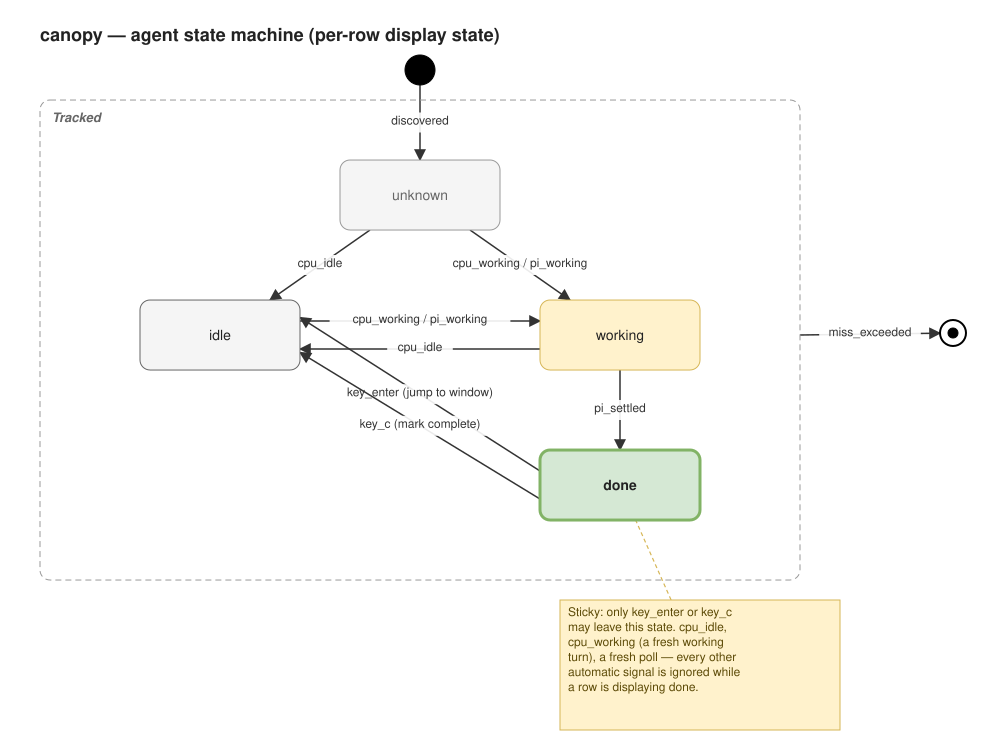

# Agent state machine

This document specifies the finite state machine (FSM) behind the state
canopy displays per agent session (one row of the dashboard), and the
exact events allowed to drive each transition.

Status: **the invariant below (`done` only exits via `key_enter` or
`key_c`) is implemented**, in `internal/tui/app.go`'s `doneEpisode`
type and `Model.updateDoneTracking`/`acknowledge`/`displayState`. See
["Where this lives in code"](#where-this-lives-in-code) for the exact
mapping.

## Scope: which "state" this describes

What a row shows is computed in two layers:

1. A **raw source signal** (`RegistryEntry.State`): `working` / `idle` /
   `done` / `unknown`. For most agent kinds this comes from a CPU-delta
   heuristic (`internal/state`, `registry.refineExternalStates`), which
   structurally can only ever produce `working`/`idle`/`unknown` — CPU
   usage alone can't tell "a turn just finished" from "has been idle for
   an hour". For a `pi` process with the optional
   `extensions/canopy-status.ts` companion installed, the raw signal
   instead comes straight from pi's own agent-lifecycle events
   (`internal/pistatus`), which is the *only* source that can ever
   produce `done`.
2. A **display overlay** (`Model.done`, `displayState()`): once a row's
   raw signal has read `done`, that episode stays displayed as `done` —
   regardless of what the raw signal reports on any later poll — until
   the user presses `enter` or `c` on it, at which point it displays as
   `idle`.

This FSM formalizes that combination into a single state per row, with
one explicit, load-bearing invariant: **once a row is `done`, only a
user action (`enter` or `c`) may move it off `done`.**

## States

| State     | Meaning                                                                                   |
|-----------|--------------------------------------------------------------------------------------------|
| `unknown` | Just discovered; no CPU sample yet to classify from.                                       |
| `idle`    | Not doing work, nothing pending for the user.                                               |
| `working` | Actively processing (tool call, generation, streaming).                                    |
| `done`    | A turn finished. **Sticky**: see invariant below.                                           |

Each row also has a lifecycle wrapper around these four: `removed`,
once the underlying process is gone. That's a separate, orthogonal
concern (tracked vs. not tracked), not a "state the agent is in", so
it's modeled as the FSM's entry/exit rather than a fifth peer state.

There is deliberately no `blocked` state here. `pi` has no
permission-gate pause to emit one from, so keeping it in the vocabulary
added a state with no real transition into it; dropped for simplicity.
(canopy's own dashboard code — `internal/tui`, `internal/registry` —
still carries pre-existing `blocked` sorting/coloring plumbing; this
FSM plan and `extensions/canopy-status.ts` both drop it.)

## Events

| Event                      | Source                                                                                   |
|-----------------------------|------------------------------------------------------------------------------------------|
| `discovered`                | `ps`/`lsof` scan sees this pid for the first time.                                        |
| `cpu_idle` / `cpu_working`  | CPU-delta heuristic classification on a poll (`internal/state`, `registry.refineExternalStates`); `cpu_working` only fires after `workingConfirmPolls` consecutive qualifying samples. |
| `pi_working`                | `canopy-status.ts` writes `working` (`before_agent_start` / `agent_start` / `tool_execution_start`, or its heartbeat). |
| `pi_settled`                | `canopy-status.ts` writes `done` (`agent_settled` — a turn ended). Unconditional: no frontmost/focus check, see ["Removed: frontmost/focus detection"](#removed-frontmostfocus-detection) below. |
| `key_enter`                 | User presses `enter` on the row in canopy (jumps to its window: VS Code integrated terminal or a Ghostty tab). |
| `key_c`                     | User presses `c` on the row in canopy (marks it seen, no jump).                          |
| `miss_exceeded`             | The process is absent from more than `MissLimit` (currently 1) consecutive polls, or has genuinely exited. |

## The invariant

> **`done` has exactly two outbound edges, both user-initiated:
> `key_enter` and `key_c`. No other event — not `cpu_idle`, not
> `cpu_working`, not `pi_working`, not a fresh poll, not a timeout — may
> move a row out of `done`.**

Both edges land on `idle`. `key_enter` additionally has a side effect
(jump to the row's window) that `key_c` does not; the resulting state
is the same either way.

Concretely, this means a `done` episode survives even a fresh
`pi_working` (the same session starting a new turn on its own, before
the user ever acknowledged the previous one in canopy): the row keeps
reading `done` until `key_enter`/`key_c`, even though the process is
now, in raw terms, actively working again. `internal/tui/app.go`'s
`updateDoneTracking` never closes an *open* episode for any reason
other than acknowledgment or the row disappearing outright — see
["Where this lives in code"](#where-this-lives-in-code).

## Removed: frontmost/focus detection

`extensions/canopy-status.ts` used to try to tell whether the user was
already looking at a session's terminal when its turn ended (an
`osascript`-based frontmost/window-title check, mirroring
`notifications.ts`'s own desktop-notification suppression), writing
`idle` instead of `done` if so. That distinction is gone: `agent_settled`
now writes `done` unconditionally, no focus check at all.

It's gone because it stopped being able to change anything the user
actually sees: canopy's dashboard already requires an explicit
`enter`/`c` before a `done` row displays as anything else, per the
invariant above, regardless of what the raw source reported at
settle-time. The frontmost check's *only* remaining effect was
suppressing the bell/flash for a turn the user had already watched
finish directly in the terminal (bell/flash logic reads the raw
`State` transition, not the display overlay — see `needsBell`'s own
doc comment in `internal/tui/app.go`). Removing it is a deliberate
trade: the bell/flash now fires on every settled turn, including ones
the user watched happen live, in exchange for `extensions/canopy-status.ts`
losing its only subprocess/AppleScript call and its Accessibility-permission
dependency entirely.

## Diagram

See [`agent-state-machine.drawio`](agent-state-machine.drawio) (open
with [draw.io](https://app.diagrams.net) or the VS Code draw.io
extension) for the editable source. Rendered:

## Where this lives in code

The raw signal comes from `internal/state` (CPU heuristic) or
`internal/pistatus` (reading `extensions/canopy-status.ts`'s status
file for a `pi` process); the display overlay and the core invariant
live in `internal/tui/app.go`:

- `doneEpisode{Since, Acked}` — one entry per row key, tracking whether
  the current `done` episode is still open (user hasn't acted yet) or
  acknowledged (user pressed `enter` or `c`), held in `Model.done`.
- `Model.updateDoneTracking(fresh)` — run every poll, before sorting:
  opens a new episode the first time a key's raw State reads `done`
  since its last acknowledgment; never closes an *open* one for any
  reason other than acknowledgment or the key disappearing (that's the
  core invariant); closes an *acknowledged* one once raw independently
  moves off `done` (e.g. a new `pi_working` turn starting after the user
  already acknowledged the previous episode).
- `displayState(e, done)` — returns `done` for an open episode (user
  hasn't acted yet), the synthetic `idle` for an acknowledged episode
  (user did act, display drops back down), or `e.State` directly for any
  row not in a `done` episode at all.
- `Model.acknowledge(entry)` — marks the episode as acknowledged on
  `key_enter`/`key_c`; a no-op if the entry is neither raw `done` nor
  has an open episode.

Regression coverage in `internal/tui/app_test.go` exercises the
invariant across a poll where the raw source has already moved off
`done` on its own — a scenario the current `extensions/canopy-status.ts`
can no longer actually produce (nothing writes `done -> idle`
automatically anymore), but the display layer still enforces
defensively, since a new `pi_working` turn starting while an episode is
still open exercises the identical code path.
