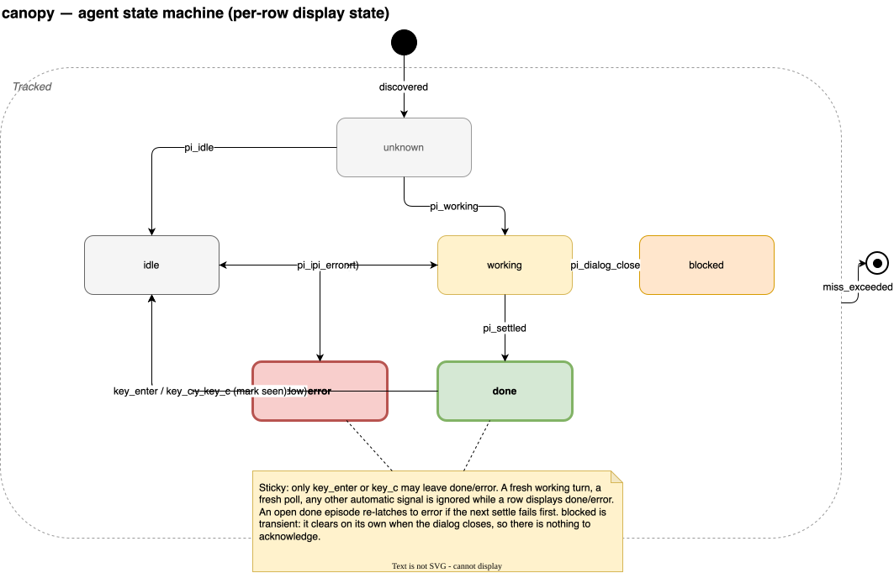

# Agent state machine

This document specifies the finite state machine (FSM) behind the state
canopy displays per agent session (one row of the dashboard), and the
exact events allowed to drive each transition.

Status: **the invariant below (`done`/`error` only exit via `key_enter`
or `key_c`) is implemented**, in `internal/tui/done.go`'s `doneEpisode`
type and `Model.updateDoneTracking`/`acknowledge`/`displayState`. See
["Where this lives in code"](#where-this-lives-in-code) for the exact
mapping.

## Scope: which "state" this describes

What a row shows is computed in two layers:

1. A **raw source signal** (`RegistryEntry.State`): `working` /
   `blocked` / `done` / `error` / `idle` / `unknown`. For a `pi` process
   with the `extensions/canopy-status.ts` companion installed, the raw
   signal comes straight from pi's own program-status state machine (pi
   v1.1.0, mirrored by the extension event for event; see
   `internal/pistatus`). Anything else, including a `pi` process whose
   status file is missing or stale, reads `unknown`. There is
   deliberately no CPU-usage fallback: canopy tracks pi sessions on this
   machine only, and a guess that cannot tell "a turn just finished"
   from "idle for an hour" is worse than an honest `unknown` (see
   ["Removed: the CPU heuristic"](#removed-the-cpu-heuristic) below).
2. A **display overlay** (`Model.done`, `displayState()`): once a row's
   raw signal has read `done` or `error`, that episode stays displayed
   as `done`/`error`, regardless of what the raw signal reports on any
   later poll, until the user presses `enter` or `c` on it (`C` for
   every open episode at once), at which point it displays as `idle`.

This FSM formalizes that combination into a single state per row, with
one explicit, load-bearing invariant: **once a row is `done` or `error`,
only a user action (`enter`, `c`, or `C`) may move it off `done`/`error`.**

## States

| State     | Meaning                                                                                  |
|-----------|------------------------------------------------------------------------------------------|
| `unknown` | No real status: the extension is not installed, its file is stale, or the kind is not pi. |
| `idle`    | Not doing work, nothing pending for the user. Also reported for an aborted run (Escape).  |
| `working` | Actively processing (tool call, generation, streaming, compaction).                       |
| `blocked` | pi is waiting on the user in an extension dialog. **Transient**: clears on its own.       |
| `done`    | A turn finished. **Sticky**: see invariant below.                                         |
| `error`   | A turn ended with an unretried error. **Sticky**: see invariant below.                    |

Each row also has a lifecycle wrapper around these six: `removed`, once
the underlying process is gone. That's a separate, orthogonal concern
(tracked vs. not tracked), not a "state the agent is in", so it's modeled
as the FSM's entry/exit rather than a seventh peer state.

`blocked` is the only state with no sticky treatment: it is transient by
definition (the dialog closing moves the raw signal on immediately), so
there is nothing for the user to acknowledge in canopy. It is also the
one attention signal pi's own reporter outranks above `working`: a dialog
waits for you whether or not a run is active underneath it.

## Events

| Event             | Source                                                                                                  |
|-------------------|----------------------------------------------------------------------------------------------------------|
| `discovered`      | `ps`/`lsof` scan sees this pid for the first time.                                                        |
| `pi_working`      | `canopy-status.ts` writes `working` (`agent_start`, `session_before_compact`, or its heartbeat).           |
| `pi_idle`         | `canopy-status.ts` writes `idle` (session start, or `agent_settled` with `aborted`).                       |
| `pi_blocked`      | `canopy-status.ts` writes `blocked` (`ui_prompt_start`, an extension dialog opened).                       |
| `pi_unblocked`    | `canopy-status.ts` writes whatever state the dialog was covering (`ui_prompt_end`).                        |
| `pi_settled`      | `canopy-status.ts` writes `done` (`agent_settled`, not aborted, last assistant message not an error).      |
| `pi_error`        | `canopy-status.ts` writes `error` (`agent_settled` where the last assistant message had `stopReason: "error"`). |
| `key_enter`       | User presses `enter` on the row in canopy (jumps to its window: VS Code integrated terminal or a Ghostty tab). |
| `key_c`           | User presses `c` on the row in canopy (marks it seen, no jump).                                            |
| `key_C`           | User presses `C` in canopy: `key_c` for every row with an open episode at once (marks all seen, no jump).  |
| `miss_exceeded`   | The process is absent from more than `MissLimit` (currently 1) consecutive polls, or has genuinely exited. |

## The invariant

> **`done` and `error` have exactly three outbound edges each, all
> user-initiated: `key_enter`, `key_c`, and `key_C`. No other event, not
> `pi_working`, not a fresh poll, not a timeout, may move a row out of
> `done` or `error`.**

All three edges land on `idle`. `key_enter` additionally has a side
effect (jump to the row's window) that `key_c` and `key_C` do not, and
`key_C` fires the `key_c` transition for every open episode at once;
the resulting per-row state is the same either way.

Concretely, this means an episode survives even a fresh `pi_working`
(the same session starting a new turn on its own, before the user ever
acknowledged the previous one in canopy): the row keeps reading
`done`/`error` until `key_enter`/`key_c`/`key_C`, even though the
process is now, in raw terms, actively working again.
`internal/tui/done.go`'s `updateDoneTracking` never closes an *open*
episode for any reason other than acknowledgment or the row disappearing
outright; while it stays open it does follow the raw word (a `done`
whose next turn failed re-latches to `error`, still the same episode, no
new bell) — see ["Where this lives in code"](#where-this-lives-in-code).

## The bell

The terminal bell rings on exactly three kinds of transition, all against
the raw signal, never the display overlay:

- a row enters `done` (new settle),
- a row enters `error` (new failure),
- a row is `blocked` on **two consecutive polls** (the debounce: a dialog
  you answer within one poll interval, the common case when you are
  sitting in that very terminal, never rings). One blocked spell rings at
  most once; the next spell re-arms.

An acknowledged episode that later gets a genuinely new settle (see the
`RealStateReportedAt` rule below) rings again. Anything else, including a
settle absorbed into a still-open episode, stays silent, see
`internal/tui/bell.go`.

## Removed: frontmost/focus detection

`extensions/canopy-status.ts` used to try to tell whether the user was
already looking at a session's terminal when its turn ended (an
`osascript`-based frontmost/window-title check, mirroring
`notifications.ts`'s own desktop-notification suppression), writing
`idle` instead of `done` if so. That distinction is gone: settles write
`done`/`error` unconditionally, no focus check at all.

It's gone because it stopped being able to change anything the user
actually sees: canopy's dashboard already requires an explicit
`enter`/`c` before an attention row displays as anything else, per the
invariant above, regardless of what the raw source reported at
settle-time. The frontmost check's *only* remaining effect was
suppressing the bell/blink for a turn the user had already watched
finish directly in the terminal (bell/blink logic reads the raw `State`
transition, not the display overlay — see `needsBell`'s own doc comment
in `internal/tui/bell.go`). Removing it is a deliberate trade: the
bell/blink now fires on every settled turn, including ones the user
watched happen live, in exchange for `extensions/canopy-status.ts`
losing its only subprocess/AppleScript call and its Accessibility-
permission dependency entirely.

## Removed: the CPU heuristic

Before the pi v1.1.0 program-status integration, rows without a real
status were classified by a poll-to-poll CPU-delta heuristic
(`internal/state`, `registry.refineExternalStates`): working if the
process burned enough CPU, idle otherwise. It is gone, not just demoted,
because canopy tracks pi sessions on this machine only, and for pi a
guessed state is strictly worse than pi's own report:

- It structurally could only produce `working`/`idle`/`unknown`: CPU
  usage alone can't tell "a turn just finished" from "has been idle for
  an hour", so `done`/`error` could never come from it.
- It read any I/O-bound wait (a slow bash command, a web fetch, an LLM
  still streaming) as `idle` mid-turn, and any post-turn CPU decay as
  `working` for up to a minute after the turn actually ended.
- It could not express `blocked` at all: a dialog waiting on the user
  reads ~0% CPU, same as idle.

What replaced it is the honest split above: pi's real five-state signal
where available, `unknown` where not. The CPU column itself stays: it
still shows the raw `ps` %cpu per row (now purely informational, no
longer feeding any state), along with RAM and Uptime.

## Diagram

See [`agent-state-machine.drawio`](agent-state-machine.drawio) (open
with [draw.io](https://app.diagrams.net) or the VS Code draw.io
extension) for the editable source. Rendered:

## Where this lives in code

The raw signal comes from `internal/pistatus` (reading
`extensions/canopy-status.ts`'s status file for a `pi` process);
anything without a fresh report stays `unknown` (`internal/registry`'s
`externalEntries`). The display overlay and the core invariant live in
`internal/tui/done.go` (the bell decision that reads the same
transitions lives in `internal/tui/bell.go`):

- `doneEpisode{State, Since, Acked, RawAt}` — one entry per row key,
  tracking which attention word the episode displays (`done` or
  `error`), and whether it's still open (user hasn't acted yet) or
  acknowledged (user pressed `enter`, `c`, or `C`), held in
  `Model.done`. `RawAt` is the raw source's own report timestamp
  (`RegistryEntry.RealStateReportedAt`, i.e. `pistatus.Status.UpdatedAt`)
  for the settle this episode currently reflects — see the note below on
  telling two settles apart.
- `Model.updateDoneTracking(fresh)` — run every poll, before sorting:
  opens a new episode the first time a key's raw State reads `done` or
  `error` since its last acknowledgment; never closes an *open* one for
  any reason other than acknowledgment or the key disappearing (that's
  the core invariant); keeps an open episode's `State`/`RawAt` current
  (a `done` that turns into an `error` re-latches in place); closes an
  *acknowledged* one once raw independently moves off its word (e.g. a
  new `pi_working` turn starting after the user already acknowledged the
  previous episode).
- `displayState(e, done)` — returns the episode's word for an open
  episode (user hasn't acted yet), the synthetic `idle` for an
  acknowledged episode (user did act, display drops back down), or
  `e.State` directly for any row not in an episode at all.
- `Model.acknowledge(entry)` — marks the episode as acknowledged on
  `key_enter`/`key_c`; a no-op if the entry is neither raw `done`/`error`
  nor has an open episode.
- `needsBell(previous, fresh, done)` — rings only for a genuine
  transition into `done`/`error` (see ["The bell"](#the-bell)).
- `newlyBlocked(previous, fresh, rung)` — the blocked side of the bell:
  rings once per spell, only after `blocked` survives two consecutive
  polls.
- `doneEpisode.NextBlinkAt`/`BurstStart`, `Model.advanceBlinks`,
  `blinkActive`/`blinkOn` — a purely visual layer on top of the
  invariant above, not a second state machine: an open episode blinks
  (a real on/off toggle, not a static highlight) the instant it opens,
  then again every five minutes for as long as it stays unacknowledged,
  so an attention row is hard to miss both right away and if it's been
  sitting there a while. Acknowledging one stops its blinking
  immediately, mid-burst if need be — `blinkActive` checks `Acked`
  directly, not just at scheduling time — since `displayState` never
  reports the episode's word for an acknowledged episode again
  regardless.

### Telling two settles apart when the raw string doesn't change

`extensions/canopy-status.ts` writes `done`/`error` once, at the
transition, with no heartbeat (unlike `working`/`blocked`/`idle`, whose
`STATUS_HEARTBEAT_MS` refresh keeps their timestamp inside
`pistatus.MaxAge`). `pistatus.Read` keeps returning that same literal
string indefinitely afterward, since nothing else has overwritten the
file yet and terminal writes are exempt from `pistatus.MaxAge` (see
below). If a *second* turn starts and settles again without canopy's
poll cadence ever happening to sample a `pi_working` reading in between
— plausible for a fast, tool-free turn — `RegistryEntry.State` reads
the literal string `"done"` on both sides of an acknowledgment, with
nothing in the string itself to tell the two settles apart.

`updateDoneTracking` and `needsBell` resolve this with
`RegistryEntry.RealStateReportedAt` (`pistatus.Status.UpdatedAt`, the
moment `canopy-status.ts` itself wrote the file, not the moment canopy
polled it): an *acknowledged* episode only reopens as new — with a
fresh bell — once this timestamp has actually advanced past the one the
episode last saw, not merely whenever `State` is still `"done"`. Without
this, the second settle was silently swallowed: no new episode, no bell,
the row just kept reading the acknowledged `idle` as if the second turn
had never finished. `RawAt` is kept current every poll while an episode
is still *open* too (not just at the moment it opens), so a settle that
happens before the eventual acknowledgment is correctly treated as
already covered by it, and only a settle *after* the acknowledgment
counts as new.

This one-shot design is also why `pistatus` exempts `done`/`error` from
its `MaxAge` staleness check: a refreshed terminal write would move
`updatedAt` forward and impersonate a brand-new settle to the comparison
above, re-ringing the bell after every acknowledgment. `working`,
`blocked`, and `idle` carry no such identity burden, so they heartbeat
and expire normally; a dead extension's row falls back to `unknown`
within `MaxAge`, while its terminal states were already safely latched
by the overlay (and process liveness is the ps scan's job, not the
file's).

The symmetric case: if the *second* settle lands while the first is still
*open* (unacknowledged), `updateDoneTracking` silently absorbs it into the
same episode rather than opening a new one — the row already reads
`done`/`error` and nothing changes on screen for it (except the word
itself, if a `done` became an `error`). `needsBell` has to know that too
(via the caller's `Model.done`, passed in as it stood at the end of the
previous poll), or it would ring a second time for a row that visibly
didn't change — exactly the drowning-out its own "still done, don't
re-ring" rule exists to avoid, just triggered by a second settle instead
of a poll timer. So `needsBell` only rings for a `RealStateReportedAt`
advance when the *previous* poll's episode for that key was already
acknowledged (the genuine reopen case above) — never while it's still
open.

Regression coverage in `internal/tui/app_test.go` exercises the
invariant across a poll where the raw source has already moved off the
episode's word on its own — the exact path a fresh `pi_working` turn
starting while an episode is still open takes — as well as all three
settles-with-no-intervening-poll cases above ("same write, still
acknowledged", "genuinely new write after acknowledgment, reopens", and
"genuinely new write while still open, absorbed silently").
`internal/tui/attention_test.go` covers the `error` side of the same
machinery and the blocked debounce.

## Cross-instance sync

Everything above is written as if there's exactly one `Model`, but
canopy has no daemon and no notion of "the" dashboard — running it in
two terminal windows at once starts two fully independent processes,
each with its own `Model.done` map. `RegistryEntry.State` itself needs
no help staying consistent between them: every instance derives it
independently but identically from the same shared, externally
observable sources (`ps`/`lsof`, and `internal/pistatus`'s per-pid status
file). The display overlay does not — `key_enter`/`key_c` only ever
mutate the acting instance's own in-memory `Model.done`, so a second
instance has no way to learn that a row was acknowledged there.

`internal/ack` closes that gap: `Model.acknowledge` best-effort writes a
small record (`Key`, `RawAt`, `At`) to
`~/.pi/agent/canopy-status/acks/<pid>-<kind>.json` — one file per row
key, written atomically (temp file + rename), the same pattern
`extensions/canopy-status.ts` already uses for its own status files.
`Model.updateDoneTracking`'s `syncAcksFromOtherInstances` step reads that
store every poll: for each episode this instance still considers open, a
matching record (same `RawAt`, not just the same key) closes the episode
locally exactly as if `key_enter`/`key_c` had fired here too. Matching
on `RawAt` — not `Key` alone — reuses the exact identity anchor the
single-instance logic above already needs (see "Telling two settles
apart" above): without it, a stale record left over from an earlier,
already-superseded episode for the same key could wrongly swallow a
brand new one.

This rides the existing poll timer (`internal/tui`'s `DefaultInterval`,
2s) rather than adding any new timer, socket, or daemon — an
acknowledgment made in one instance becomes visible in another within
one poll interval of each. Cleanup piggybacks on the same triggers that
already close a local episode: once a key disappears from a poll
(session ended) or an acknowledged episode's raw source moves off
`done`/`error`, `updateDoneTracking` removes the ack record too, so the
shared store doesn't accumulate one file per episode forever.
`ack.MaxAge` is a defensive backstop for the one case that trigger-based
cleanup can't reach on its own: every canopy instance closing before any
of them ever notices a particular episode close.

Regression coverage for this lives in `internal/tui/done_sync_test.go`,
using an in-memory fake in place of the real
`~/.pi/agent/canopy-status/acks` directory
(`internal/tui/main_test.go`'s `withAckStore`) so two `Model`s sharing
that fake stand in for two concurrently running canopy processes.
